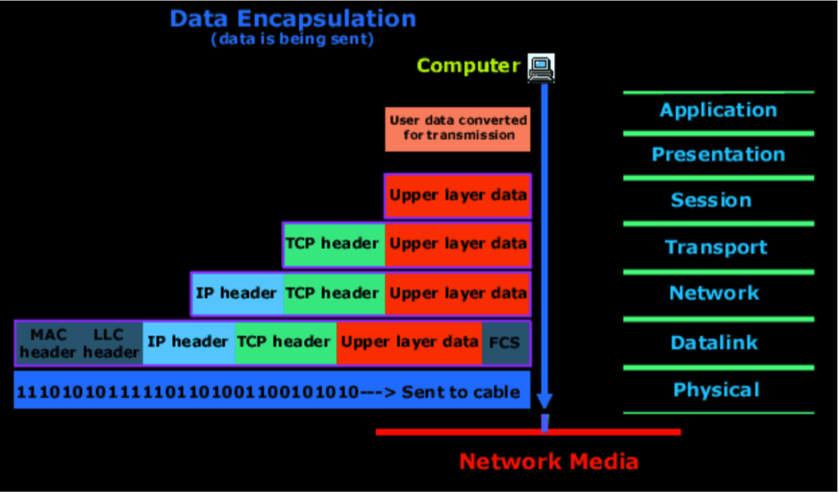

## Многослойность сети
OSI

1. Phisical -> Сетевые карты
2. Data link -> MAC адреса
   - NAT и ARP(adress resolution protocol)
4. Network -> DHSP DNS
5. Transport -> NTP, TCP, UDP, Порты
6. Session -> 
7. Presentation -> 
8. Application -> 

Протоколом определяется как должно проиходить взаимодействие между слоями.  Администраторы работают с 2,3,4 слоем, а 5,6,7 объединяют в один(Application)

## IP-adress/mask
**ip4** - 192.168.10.100 - состоит из 4 октет. Занимает 32 бита. 

**ipv6** -  fe80:0:0:0:200:f8ff:fe21:67cf - состоит из 8 элементов в 16-ричной системе счисления, разделённых двоеточием. Занимает 128 бит.

Маска сети может задаваться в виде четырёх трёхзначных чисел(255.255.255.0), а может одним десятичным числом после ip адреса(192.168.10.100/24) - и тот и другой вариант переводится в двоичный вариант. Десятичное число обозначает количество занятых бит, прим 1111 1111 . 1111 1111 . 1111 1111 . 0000 0000 - является образцом расшифровки маски 24 или 255.255.255.0. Там где бит в значении 1, ip адрес остаётся неизменным(данная часть называется адресом), а там где бит маски имеет значение 0, ip адрес может менять своё значение(это хост).
В нашем примере ip может изменяться в диапазоне 192.168.10.0 - 192.168.10.255. Крайние значения обычно резервируются и не выдаются устройствам. хост 0 - резервируется узлом, обеспечивающим прямой выход в интернет(роутер). Хост 255 - является broadcast'ом, необходимый для обращения сразу всем устройствам в локальной сети. Выходит, что ip-адрес состоит из адреса и хоста, хост определяется маской.

Пример:
--
Необходимо определить диапазон адресов ip-адреса 201.182.20.55/22 
1. Переводим ip в двоичную систему -  
   11000111 . 10110100 . 00010100 . 00110111
2. 11111111 . 11111111 . 11111100 . 00000000   -распаковываем маску
3. Видим что последний октет может изменяться в полном диапазоне(0-255), а третий октет может быть выражен числами в диапазоне 00010100-00010111, что соответствует 20-23
4. Имеем следующее
   - 201.182.20.0 - Адрес для выхода в сеть
   - 201.182.20.1 - Первый доступный адрес
   - 201.182.23.254 - Последний доступный адрес
   - 201.182.23.255 - Broadcast. Широковещательный адрес
5. Количество узлов, возможных в подобной сети.   256*4-2 = 1022

## DHCP - Dynamic Host Configuration Protocol
Чтобы вручную не прописывать каждому компьютеру свой ip, маршрутизаторами и другими узлами используется протокол **dhcp**.

## DNS Domain Name System
Если компьютер в сети имеет статичный ip, ему можно задать доменное имя. DNS обеспечивает сопоставление доменных имён с ip-адресами.
    
## MAC 
Позволяет идентифицировать устройство(wi-fi адаптер, usb-модем, PCI сетевая карта) при помощи которого осуществляется выход в сеть с конкретного узла(компьютера). 
занимает 12 байт информации. Первые 6 байт идентифицирует производителя, оставшиеся 6 байт - идентификатор устройства. 00:15:F2:20:4D:6B

## NAT Network Address Translation
Используется для того чтобы компьютеры из приватной сети могли выходить в глобальную сеть путём подмены адреса отправителя.

## Port and Protocol
- 22 - ssh
- 80 - http
- ------
- TCP - Transfer Control Protocol с подтверждением доставки
- UDP - User Datagram Protocol без подтверждения доставки 
- ICMP - Internet Control Message Protocol

## naming interfaces
1. 
   - en - Ethernet interface
   - wl - WLAN interface
   - ww - WWAN interface
2. 
   - 0 - used for inboard
   - s - hotplug slot
   - p - PCI location
   - x - можно использовать любой символ для обозначения устройства в сети основанного на MAC адресе.
4. индекс интерфейса
4. в случае если не удаётся выполнить идентификацию вышеперечисленных параметров, дается название eh0
