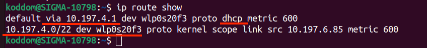

## Проверка сетевых конфигураци
Администрирование сети Linux состоит из проверки 
- ip адреса и маски подсети
- роутинга
- доступности портов и севисов

Для начала познакомимся с утилитой **ip**. Она имеет большое количество опций и объектов манипуляции. Введите эту команду в консоль и убедитесь в этом сами.
```bash
ip
```
теперь введите 
```bash
ip address show
```


**ip addr** - объект для конфигурирования адресов.
На экране вы увидите все интерфейсы подключённые к вашей машине. На скриншоте видно, что интерфейс **wlp0s20f3** имеет состояние **UP**, мак адрес адаптера и присвоенный компьютеру ip-адрес(v4, v6) вместе с маской.

Вывести на экран состояние только интересующего нас интерфейса можно просто передав название интерфейска в конец команды.
```bash
ip address show lp0s20f3
```

Чтобы получить информацию о принятых и переданных пакетах информации, используйте флаг **-s** вместе с объектом **link**
```bash
ip -s link show lp0s20f3
```


**ip link** - объект для настройки состояния с сетью<br>
Давайте отключим интерфейс, чтобы он больше не принимал и не отправлял пакеты. 

```bash
ip link set dev wlp0s20f3 down
```


## Смотрим в интернет.

Каждый раз когда вы вводите в адресной строке какой-нибудь адрес, он преобразуется в ip-адресс и вы "общаетесь" к определённым сервером. За подобный механизм преобразования строк в числа отвечает специальный протокол, который называется DNS.

Но прежде, вам нужно найти точку выхода в сеть используемую вашим роутером. Команда **ip route show** покажет вам её.
```bash
ip route show
```

В первой строке вы увидите через какой адрес происходит общение компьютеров в сети, какой интерфейс при этом используется и то, что этот адрес был назначен DHCP сервером. 

Во второй строке указан диапазон локальных адресов общающихся с интерфейсом **wlp0s20f3**.

Вы наверняка знаете, что когда вы отправляете запрос на сервер гугла, прежде чем запрос дойдёт до конечного сервера он пройдёт через множество роутеров. Отследить маршрут по которому путешествует пакет данных можно используя утилиту traceroute.
```bash
traceroute google.com
```

Как видите, в первой строке, сначала наш пакет ушёл на местный роутер, потом роутер с которым он соседствует и далее на роутер провайдера. Не все провайдеры выдают о себе информацию, в этих строчках вы можете видеть звёздочки.

В итоге пакет дошёл до адреса 142.251.1.100. Однако такая огромная махина как Google имеют далеко не один сервер. 
```
host google.com
```


Я скопирую адрес 64.233.161.100 и  вставлю в адресную строку браузера. Очевидно открылся гугл.

## Задача

- [ ] сменить dns

- [ ] заново попробовать открыть гугл

- [ ] использовать **nmcli** для редактирования текущего соединения.

- [ ] настроить получение **ip** c помощью **dhcp**

- [ ] настроить сетевой адаптер на статический ip-адрес на этом интерфейсе, в качестве **dns** и **gateway**  укажите адрес хоста.

## Советы

- **/etc/hosts** - локальный аналог DNS. Прописывается соответствие ip адресов доменным адресам и наоборот.

- **/etc/resolv.conf** - список имён серверов, которые мы можем опрашивать. Генерируется при запуске сети, поэтому все изменения в нём временные.

- **/etc/nsswitch.conf** - файл позволяет регулировать порядок просмотра записей соответстивия ip-адресов с доменами.

- **/etc/services** - список сервисов

- **/etc/protocols** - список протоколов

### tags
IP, IPv4, IPv6, protocol, port, subnet mask, DNS, DHCP, connection, interface, FQDN

